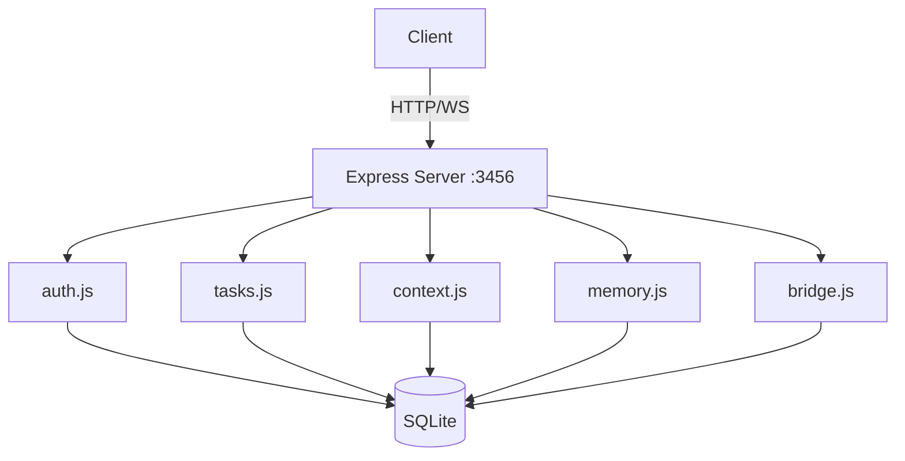
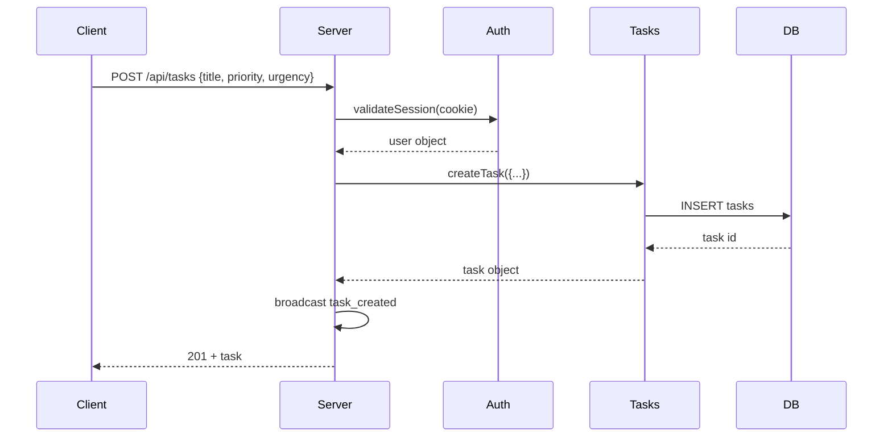
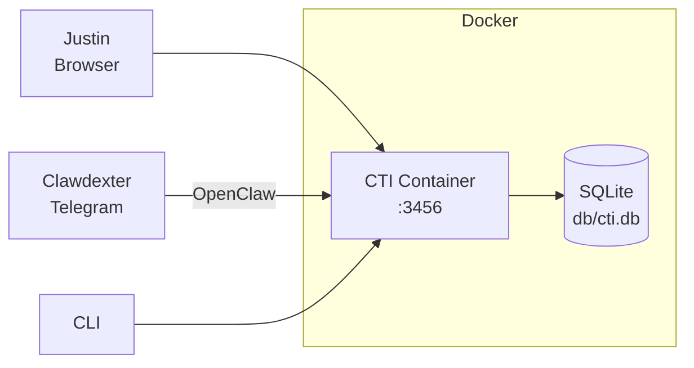

# Creative AI — Developer Onboarding Guide

**Repository:** https://github.com/johrenberger/creative-ai  
**Commit:** `cd7585619f307bcae533ea785cea4c668733166a`  
**Generated:** 2026-06-06

---

## 1. README / Instruction Files Summary

CTI (Clawdexter's Thinking Interface) is a local-first productivity layer for structured human-AI collaboration. It provides:

- **Task Capture** — Structured task input with priority/urgency scoring
- **Context Engine** — Project state and key-value storage
- **Memory Bank** — Structured knowledge with retrieval
- **Priority Queue** — Attention management
- **Communication Bridge** — Structured exchanges (subject, content, intent, impact)

**Quick Start:**
```bash
npm install
npm start        # → http://localhost:3456
npm run cli      # → Interactive CLI
npm test         # → Run tests
```

**Tech Stack:** Node.js 18+ / Express / WebSocket / SQLite / bcrypt

---

## 2. Detailed Technology Stack

| Component | Technology | Version |
|-----------|------------|---------|
| Runtime | Node.js | >= 18.0.0 |
| HTTP Framework | Express | ^4.21.0 |
| WebSocket | ws | ^8.18.0 |
| Database | SQLite (better-sqlite3) | ^12.10.0 |
| Password Hashing | bcrypt | ^6.0.0 |
| Security Headers | helmet | ^8.0.0 |
| CORS | cors | ^2.8.5 |
| Rate Limiting | express-rate-limit | ^7.4.0 |
| HTML Sanitization | dompurify | ^3.1.6 |
| Markdown Parsing | marked | ^14.1.0 |
| Test Framework | Jest | ^29.7.0 |
| HTTP Testing | supertest | ^7.2.2 |
| Linter | ESLint | ^9.12.0 |

---

## 3. System Overview and Purpose

CTI is a productivity interface for Justin and Clawdexter to communicate structured information. It runs locally in a Docker container and exposes:

- REST API on port 3456
- WebSocket at `ws://localhost:3456/ws`
- Web UI at `http://localhost:3456`

The system is **local-first** — all data stays in the container. No external API dependencies.

---

## 4. Project Structure and Reading Recommendations

```
creative-ai/
├── src/
│   ├── server.js          # Main entry — Express + WebSocket + all routes
│   ├── auth.js            # User accounts, session management, bcrypt
│   ├── db.js              # SQLite connection, schema init, stats
│   ├── tasks.js           # Task CRUD with priority/urgency scoring
│   ├── context.js         # Key-value context storage, preferences
│   ├── memory.js          # Structured memory bank with search
│   ├── bridge.js          # Communication exchanges (Justin ↔ Clawdexter)
│   ├── cli.js             # Interactive CLI client
│   └── middleware/
│       └── auth.js        # requireAuth, optionalAuth middleware
├── db/
│   └── schema.sql         # SQLite schema — all tables and indexes
├── tests/                 # Jest tests (JS) + e2e (Python)
├── docs/                  # ADR files
├── .github/workflows/
│   ├── ci.yml             # GitHub Actions CI
│   └── deploy-hostinger.yml
└── package.json
```

**Reading Order:**
1. `src/server.js` — understand routes and middleware
2. `db/schema.sql` — understand data model
3. `src/auth.js` — understand session-based auth
4. `src/tasks.js`, `src/context.js`, `src/memory.js`, `src/bridge.js` — core domain

---

## 5. Key Components

### Server (src/server.js)
Express app with security middleware (helmet, cors, rate-limit), all REST routes, WebSocket broadcast, image proxy with SSRF protection.

### Authentication (src/auth.js)
- Passwords hashed with bcrypt (cost 12)
- Session tokens: 64-char hex, 7-day duration, 30-min idle timeout
- Sliding expiration on activity

### Database (src/db.js)
- SQLite with WAL mode, foreign keys ON, 256MB mmap
- Schema applied at startup from `db/schema.sql`

### Tasks (src/tasks.js)
- CRUD with priority (1-10) and urgency (1-10) scoring
- Score formula: `(11 - urgency) * 2 + (11 - priority)` — lower = more urgent
- Status: pending, in_progress, blocked, done, cancelled

### Context (src/context.js)
- Key-value storage with project scoping (global or project-specific)
- Auto-infers JSON type for objects/numbers/booleans

### Memory (src/memory.js)
- Structured storage with type classification: note, decision, preference, pattern, learning, fact
- Access tracking (access_count, accessed_at)
- LIKE-based search

### Bridge (src/bridge.js)
- Communication exchanges between Justin and Clawdexter
- Exchange types: task, clarification, decision, feedback, planning, review
- Requires: subject, content; Optional: intent, impact
- Responses stored as memories automatically

---

## 6. Execution and Data Flows

### Authentication Flow
1. `POST /api/auth/login` with `{username, password}`
2. Lookup user, verify bcrypt hash
3. Create session in SQLite, return `session_id` cookie (httpOnly, 7-day)
4. Subsequent requests include cookie → `requireAuth` validates

### Task Creation Flow
1. `POST /api/tasks` with `{title, ...}`
2. `requireAuth` validates session
3. Insert into SQLite, calculate priority score
4. Broadcast via WebSocket to all clients
5. Return created task

### Bridge Exchange Flow
1. `POST /api/bridge/message` with `{exchangeType, subject, content, intent, impact}`
2. Validate exchange type against allowed values
3. Insert into exchanges table
4. Broadcast `exchange_created` via WebSocket
5. Response stored as memory via `storeMemory()`

---

## 7. Database Schema Overview

**Tables:** users, sessions, tasks, context, memories, exchanges, preferences

### Key Relationships
- users (1) → sessions (many) via `user_id` (cascade delete)
- No FK from tasks/context/memories/exchanges to users — uses `created_by` string fields

### Indexes
- sessions: token, user, expires
- tasks: status, project, priority
- memories: tags, type
- exchanges: status, type

---

## 8. Dependencies and Integrations

**No external API integrations.** CTI is fully self-contained:
- Local SQLite for all data
- No OAuth / SSO
- No email / SMS / push notifications
- No cloud storage
- No message queues

---

## 9. API Documentation

### Auth
| Method | Endpoint | Description |
|--------|----------|-------------|
| POST | `/api/auth/register` | Register `{username, email, password}` |
| POST | `/api/auth/login` | Login → sets session_id cookie |
| POST | `/api/auth/logout` | Clear session |
| GET | `/api/auth/session` | Check auth status |

### Tasks
| Method | Endpoint | Description |
|--------|----------|-------------|
| POST | `/api/tasks` | Create task |
| GET | `/api/tasks` | List (filterable) |
| GET | `/api/tasks/:id` | Get one |
| PATCH | `/api/tasks/:id` | Update |
| DELETE | `/api/tasks/:id` | Delete |

### Context
| Method | Endpoint | Description |
|--------|----------|-------------|
| POST | `/api/context` | Set key-value |
| GET | `/api/context` | List all |
| GET | `/api/context/:key` | Get one |
| DELETE | `/api/context/:key` | Delete |

### Memory
| Method | Endpoint | Description |
|--------|----------|-------------|
| POST | `/api/memory` | Store |
| GET | `/api/memory/search` | Search |
| GET | `/api/memory/recent` | Recent |
| GET | `/api/memory/:id` | Get one |
| PATCH | `/api/memory/:id` | Update |
| DELETE | `/api/memory/:id` | Delete |

### Bridge
| Method | Endpoint | Description |
|--------|----------|-------------|
| POST | `/api/bridge/message` | Create exchange |
| GET | `/api/bridge/exchange` | List |
| GET | `/api/bridge/exchange/:id` | Get one |
| POST | `/api/bridge/exchange/:id/respond` | Respond |
| POST | `/api/bridge/exchange/:id/close` | Close |
| POST | `/api/bridge/exchange/:id/escalate` | Escalate |

---

## 10. Architecture Diagrams

### Component Diagram


### Data Flow — Task Creation


### Deployment Diagram


---

## 11. Testing

**Test Command:** `npm test`

**Framework:** Jest with `--experimental-vm-modules` (ESM support)

**Files:** `tests/*.test.js` + Python e2e (`tests/e2e/`)

**Coverage:** Enabled via `npm run test:coverage` (per-file enforcement removed due to Jest ESM issues)

**CI:** GitHub Actions runs lint, test, security audit

---

## 12. Error Handling and Logging

- All routes use try/catch with `res.status(500).json({ error: err.message })`
- No structured logging — only `console.log`/`console.error`
- Health endpoint: `GET /health` returns uptime and stats
- No distributed tracing or metrics

---

## 13. Security Considerations

- **Auth:** bcrypt cost 12, session tokens 64-char hex, 7-day expiry, 30-min idle timeout
- **Cookies:** httpOnly, sameSite=Lax, path=/
- **Rate Limiting:** 120 req/min on /api/
- **Security Headers:** Helmet CSP, X-Frame-Options DENY, HSTS
- **SSRF Protection:** Image proxy blocks private network ranges
- **Input Validation:** Required fields check, string sanitization (no `<>`), max lengths
- **No RBAC** — all authenticated users share access

---

## 14. Architecture Risks and Observations

| Risk | Severity | Category |
|------|----------|----------|
| No structured logging | Medium | Operational |
| Session cleanup not automated | Low | Maintainability |
| No database migration system | Medium | Reliability |
| Generic error handling | Medium | Reliability |
| Python e2e tests may not run in CI | Medium | Testing |

---

## 15. Developer Productivity Guide

### First-Week Reading Order
1. `README.md` — project overview
2. `src/server.js` — all routes and middleware
3. `db/schema.sql` — data model
4. `src/auth.js` — authentication
5. `CONTRIBUTING.md` — development setup

### Fastest Local Startup
```bash
npm install
docker-compose up -d   # or: npm start
```

### Debugging Entry Points
- Set `CTI_START_SERVER=true` to start HTTP server
- Add `console.log` in route handlers (no structured logging)
- Check `GET /health` for runtime stats
- Check `GET /api/stats` for entity counts

### Common Extension Points
- Add new route handlers in `server.js`
- New modules in `src/` following existing pattern (getDb, CRUD functions)
- Auth middleware in `src/middleware/auth.js`
- CLI commands in `src/cli.js` MODES object

---

## 16. Build / Deploy / Infrastructure

**Build:** `npm run build` (no-op — ES modules run directly)

**Container:** Docker + docker-compose
- Port 3456 exposed
- `CTI_DB_PATH=/data/cti.db` for persistent storage
- `CORS_ORIGIN` configurable

**CI:** GitHub Actions (ci.yml)
- Node 18
- lint → test → security audit

**Deploy:** GitHub Actions to Hostinger VPS (deploy-hostinger.yml)

---

## 17. ADR Baseline

- [docs/adr/000-template.md](https://github.com/johrenberger/creative-ai/blob/cd7585619f307bcae533ea785cea4c668733166a/docs/adr/000-template.md)
- [docs/adr/001-current-architecture-baseline.md](https://github.com/johrenberger/creative-ai/blob/cd7585619f307bcae533ea785cea4c668733166a/docs/adr/001-current-architecture-baseline.md)

---

## 18. Discovery Confidence and Unknowns

| Category | Confidence | Notes |
|----------|------------|-------|
| Architecture | High | Monolithic Express + SQLite confirmed |
| Business Logic | High | All modules reviewed and understood |
| Security | Medium | Auth reviewed; no penetration testing performed |
| Deployment | High | Docker + GitHub Actions confirmed |
| Testing | Medium | Jest confirmed; Python e2e CI unclear |
| Data | High | Schema reviewed; migrations not explicitly handled |
| Integrations | High | No external integrations found |

**Overall Discovery Confidence:** High

### Top 5 Files to Read First
1. [src/server.js](https://github.com/johrenberger/creative-ai/blob/cd7585619f307bcae533ea785cea4c668733166a/src/server.js) — main entry
2. [db/schema.sql](https://github.com/johrenberger/creative-ai/blob/cd7585619f307bcae533ea785cea4c668733166a/db/schema.sql) — data model
3. [src/auth.js](https://github.com/johrenberger/creative-ai/blob/cd7585619f307bcae533ea785cea4c668733166a/src/auth.js) — authentication
4. [CONTRIBUTING.md](https://github.com/johrenberger/creative-ai/blob/cd7585619f307bcae533ea785cea4c668733166a/CONTRIBUTING.md) — dev setup
5. [docs/adr/001-current-architecture-baseline.md](https://github.com/johrenberger/creative-ai/blob/cd7585619f307bcae533ea785cea4c668733166a/docs/adr/001-current-architecture-baseline.md) — architecture summary

### Unknowns / Limitations
- Python e2e test CI integration not confirmed
- Database migration strategy not explicit
- WebSocket authentication status unclear
- Specific Hostinger deployment details not reviewed